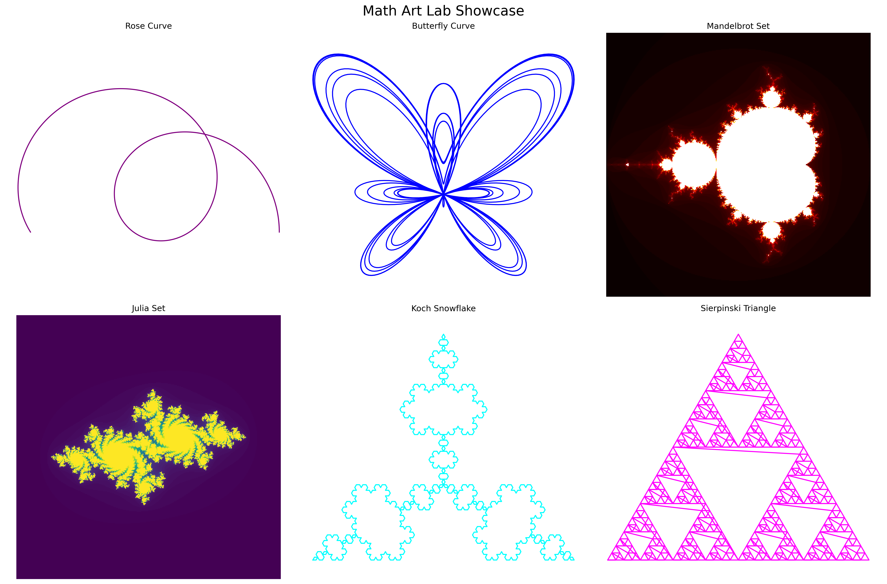
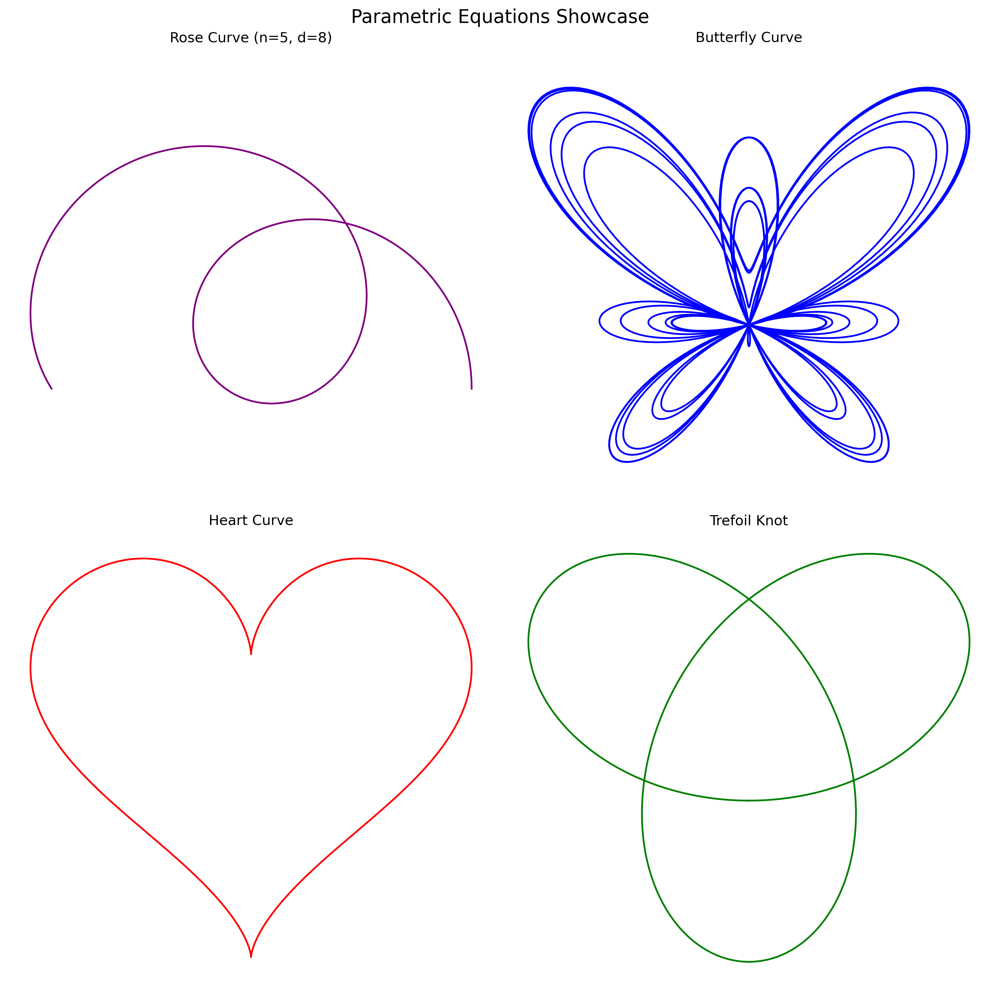
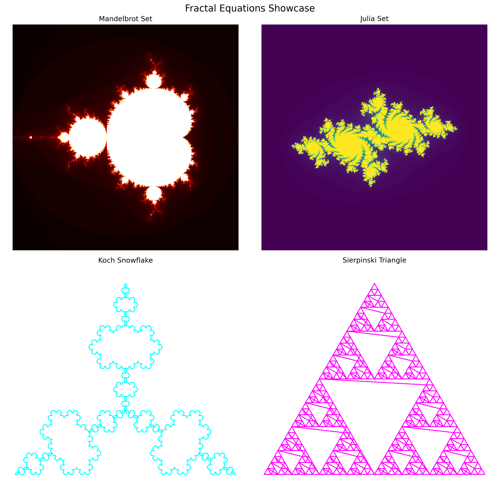

# Math Art Lab



A Python library for creating beautiful mathematical art using parametric equations and fractals.

## Features

- **Parametric Curves**: Create beautiful curves like butterfly, rose, and lissajous
- **Fractals**: Generate Mandelbrot and Julia sets
- **Customizable**: Adjust parameters and colors to create unique art
- **High Quality**: Generate high-resolution images
- **Easy to Use**: Simple API for creating complex mathematical art

## Installation

```bash
pip install math-art
```

## Quick Start

```python
from math_art.equations.parametric import ButterflyCurve
import matplotlib.pyplot as plt
import numpy as np

# Create a butterfly curve
curve = ButterflyCurve(amplitude=2.0)
t = np.linspace(0, 12*np.pi, 10000)
x, y = curve.evaluate(t)

# Plot the curve
plt.figure(figsize=(10, 10))
plt.plot(x, y, c='viridis')
plt.axis('equal')
plt.axis('off')
plt.savefig('butterfly.png', dpi=300)
```

## Examples

### Parametric Equations


### Fractals


## Documentation

- [API Documentation](docs/api/api_reference.md): Detailed documentation of all equations and parameters
- [Tutorial](docs/tutorials/getting_started.md): Step-by-step guide to creating mathematical art
- [Development Guide](docs/development.md): Guide for contributors
- [Gallery](docs/gallery.md): Showcase of mathematical art

## Contributing

We welcome contributions! Please see our [Development Guide](docs/development.md) for detailed contribution guidelines.

## License

This project is licensed under the MIT License - see the [LICENSE](LICENSE) file for details. 