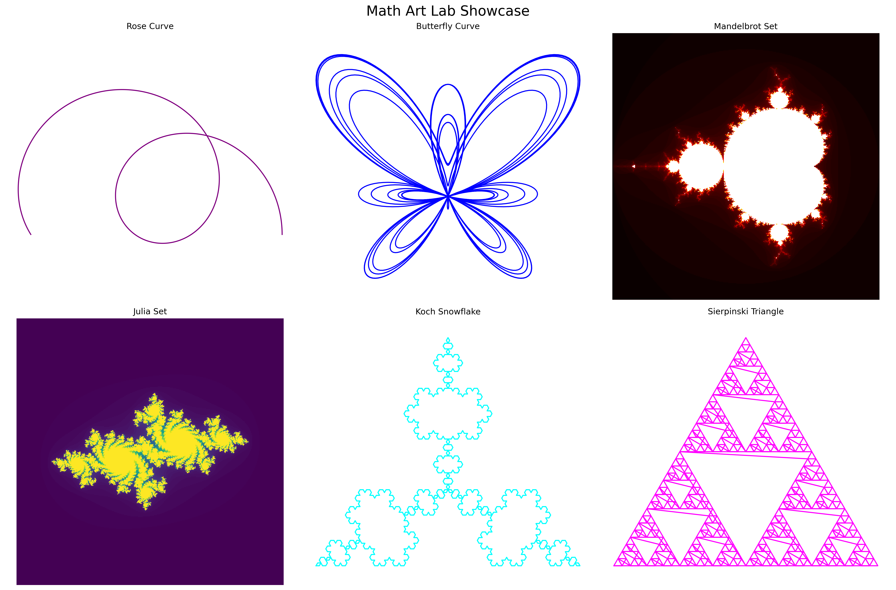
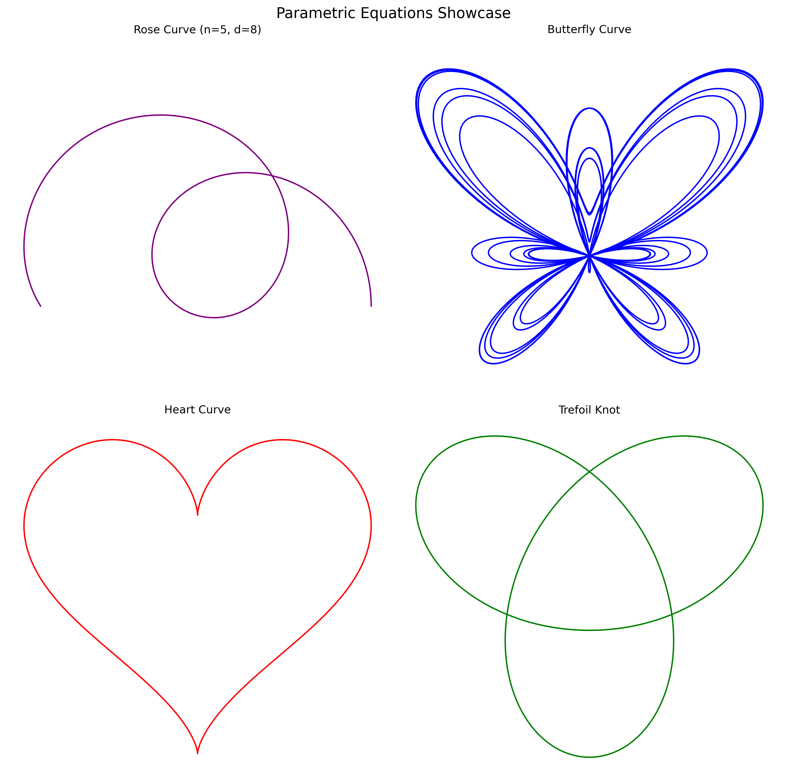
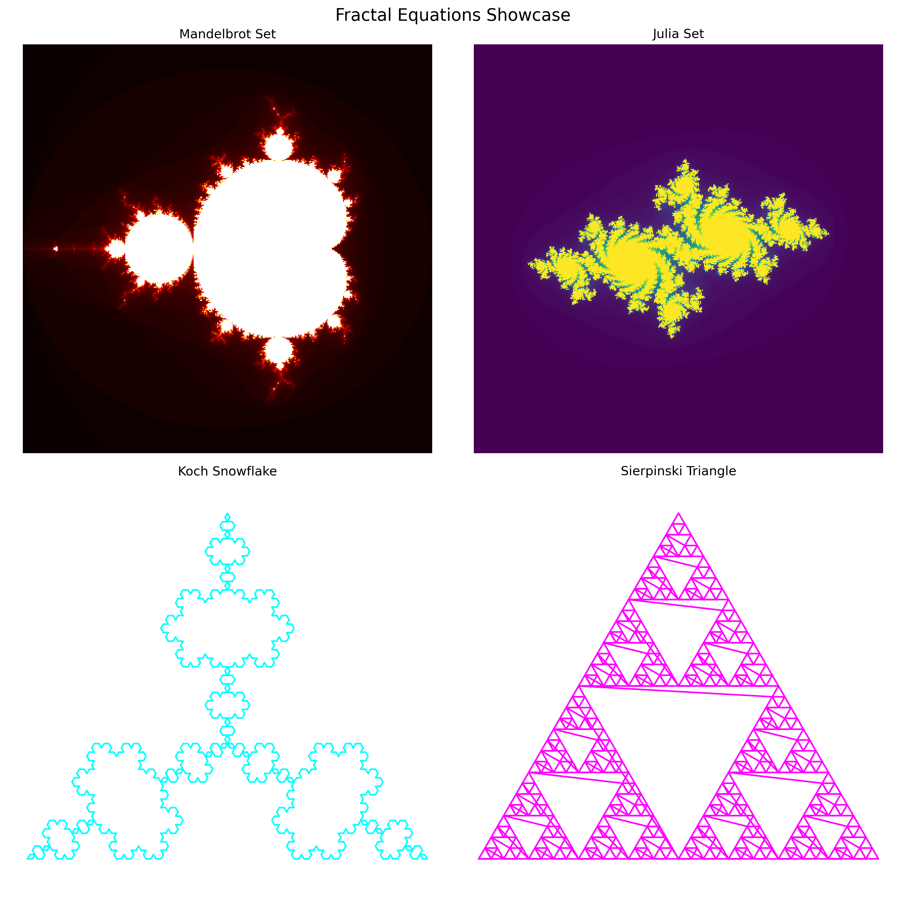

# Math Art Lab

A Python library for creating beautiful mathematical art through parametric equations and fractals.



## Features

- **Parametric Equations**
  - Rose Curves
  - Butterfly Curves
  - Heart Curves
  - Trefoil Knots
  - And more...

- **Fractal Equations**
  - Mandelbrot Set
  - Julia Set
  - Koch Snowflake
  - Sierpinski Triangle

- **Transformations**
  - Rotation
  - Scaling
  - Translation

## Installation

```bash
pip install math-art-lab
```

## Quick Start

```python
from math_art_lab import RoseCurve, MandelbrotSet
import matplotlib.pyplot as plt

# Create a rose curve
rose = RoseCurve(n=5, d=8)
x, y = rose.generate_points()

# Plot
plt.figure(figsize=(6, 6))
plt.plot(x, y)
plt.axis('equal')
plt.show()

# Create a Mandelbrot set
mandelbrot = MandelbrotSet(width=800, height=800)
fractal = mandelbrot.evaluate(None)

# Plot
plt.figure(figsize=(8, 8))
plt.imshow(fractal, cmap='hot')
plt.axis('off')
plt.show()
```

## Gallery

### Parametric Equations


### Fractal Equations


## Documentation

- [API Documentation](docs/api_documentation.md)
- [Tutorial](docs/tutorial.md)
- [Development Guide](docs/development.md)

## Contributing

We welcome contributions! Please see our [Development Guide](docs/development.md) for details on how to contribute.

## License

This project is licensed under the MIT License - see the [LICENSE](LICENSE) file for details. 