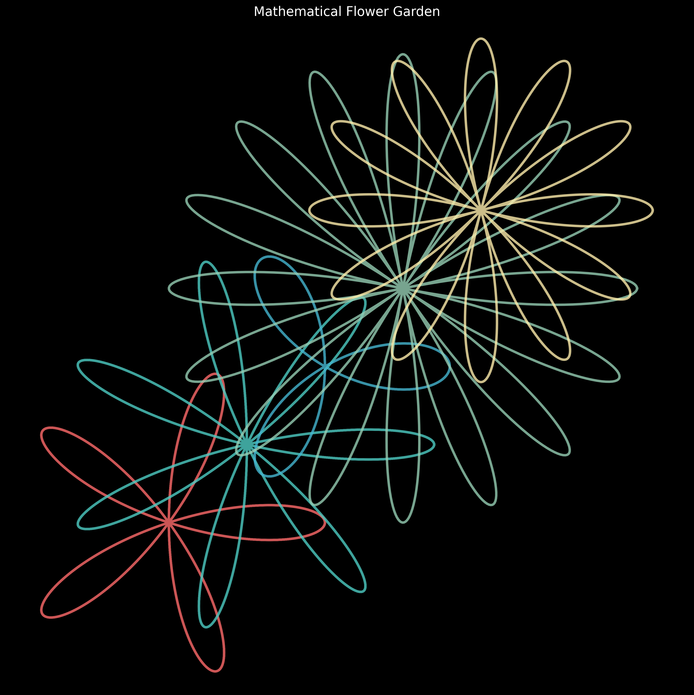
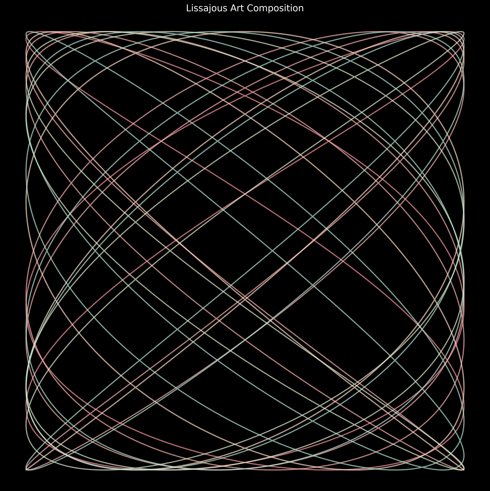
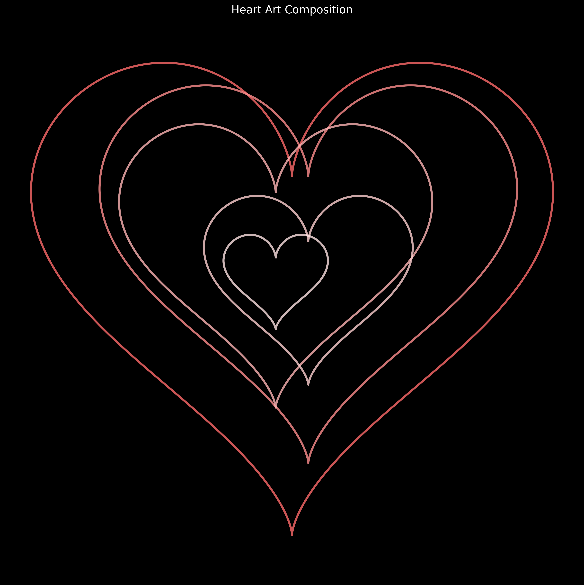
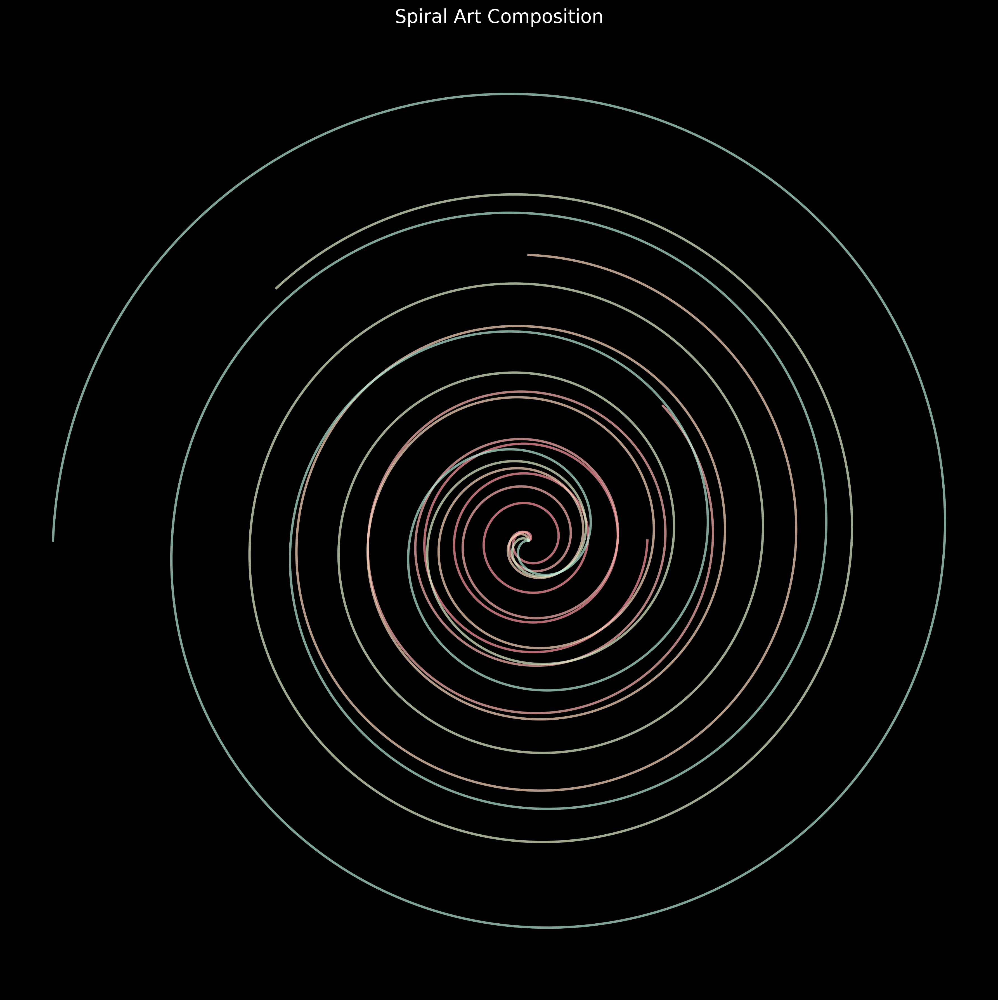

# Beginner's Math Art

A simple Python library for creating mathematical art, perfect for beginners!

## What is Mathematical Art?

Mathematical art is the creation of beautiful images using mathematical equations. This library makes it easy to create your own mathematical art, even if you're just starting to learn programming.

## Gallery

Here are some examples of what you can create with this library:

### Mathematical Flower Garden

A beautiful garden of mathematical flowers created using rose curves with different numbers of petals.

### Lissajous Art

Complex patterns created by combining sine waves with different frequencies and phase shifts.

### Heart Art

A composition of hearts in different sizes and positions, showing how simple equations can create beautiful shapes.

### Spiral Art

Mesmerizing spiral patterns created by varying growth rates and rotations.

## Installation

1. Make sure you have Python installed (version 3.6 or higher)
2. Install the required packages:
```bash
pip install numpy matplotlib
```

## Quick Start

Here's a simple example to create a circle:

```python
from beginner_math_art.simple_equations import Circle
import matplotlib.pyplot as plt

# Create a circle with radius 2
circle = Circle(radius=2)

# Get the x and y coordinates
x, y = circle.plot()

# Plot the circle
plt.figure(figsize=(6, 6))
plt.plot(x, y)
plt.show()
```

## Examples

The library comes with two sets of examples to help you get started:

### Basic Examples
1. **Simple Circle**: Creates a perfect circle
2. **Spiral**: Creates a growing spiral pattern

To run the basic examples:
```bash
cd beginner_math_art/examples
python simple_examples.py
```

### Advanced Examples
1. **Rose Curves**: Beautiful flower-like patterns with different numbers of petals
2. **Lissajous Curves**: Interesting patterns created by combining sine waves
3. **Heart Curves**: Fun heart-shaped patterns in different sizes

To run the advanced examples:
```bash
cd beginner_math_art/examples
python advanced_examples.py
```

## Available Equations

### Basic Equations
- `Circle(radius)`: Creates a perfect circle
- `Spiral(growth_rate)`: Creates a growing spiral

### Advanced Equations
- `RoseCurve(k, n)`: Creates flower-like patterns
  - `k`: Controls the size of the petals
  - `n`: Controls the number of petals
- `LissajousCurve(a, b, delta)`: Creates patterns from sine waves
  - `a`: Frequency in x-direction
  - `b`: Frequency in y-direction
  - `delta`: Phase difference
- `HeartCurve(scale)`: Creates heart shapes
  - `scale`: Controls the size of the heart

## How to Create Your Own Equations

You can create your own mathematical equations by following these steps:

1. Create a new class that inherits from `BaseEquation`
2. Implement the `evaluate` method
3. Use your equation to create art!

Here's an example of creating a custom equation:

```python
from beginner_math_art.base_equation import BaseEquation
import numpy as np

class MyCustomEquation(BaseEquation):
    def evaluate(self, t):
        # Your equation here
        x = t * np.cos(t)
        y = t * np.sin(t)
        return x, y
```

## Learning Resources

- [Python for Beginners](https://www.python.org/about/gettingstarted/)
- [NumPy Tutorial](https://numpy.org/doc/stable/user/absolute_beginners.html)
- [Matplotlib Tutorial](https://matplotlib.org/stable/tutorials/index.html)
- [Parametric Equations](https://en.wikipedia.org/wiki/Parametric_equation)
- [Polar Coordinates](https://en.wikipedia.org/wiki/Polar_coordinate_system)

## Need Help?

If you're stuck or have questions:
1. Check the examples in the `examples` directory
2. Look at the source code in `simple_equations.py`
3. Feel free to ask questions in the issues section

## License

This project is licensed under the MIT License - see the LICENSE file for details. 